# Segmentación Estratégica de Clientes E-commerce
**Fecha:** 16 de Febrero, 2026
**Autores:** Jefferson Velasquez, Frank Macias, Jorge Murillo
**Asunto:** Identificación de Perfiles de Comportamiento de Compra mediante Clustering (Aprendizaje No Supervisado)
---
## 1. Visión General
Este proyecto utiliza algoritmos de Machine Learning no supervisado (**K-Means, DBSCAN**) validados mediante reducción de dimensionalidad (**PCA** y **t-SNE**) para segmentar la base de clientes de una plataforma de e-commerce con servicios personalizados.

### 1.1 Resumen del problema
En el contexto del marketing digital y publicidad, identificar qué usuarios tienen un cierto comportamiento al momento de adquirir un producto es vital para optimizar el retorno de inversión (ROI) publicitario. El objetivo de este análisis es identificar grupos de usuarios con características de compra similar para enfocar campañas de marketing
asi como alinear esfuerzos en relación a la publicidad para mejorar la retención de los mismos.

Dataset: "E-commerce customer behavior".

---
## 2. Resumen de Hallazgos

K-Means identificó **3 Arquetipos de Comprador** alineados con los niveles de membresía:
- Bronze
- Silver
- Gold

Sin embargo, **DBSCAN reveló un 4to micro-segmento oculto**: 
- 34 clientes Silver jóvenes (~27 años), **100% insatisfechos** y con **53 días de inactividad**

Este último es un grupo de **alto riesgo de churn** que K-Means no logra aislar al forzar particiones simétricas. Este hallazgo demuestra el valor complementario de ambos algoritmos: K-Means para estrategia masiva y DBSCAN para detectar señales de alerta temprana.

En base a esta información, se ha optado por distribuir los grupos de la siguiente forma:

### 2.1 Matriz de segmentos (K-Means)
| Cluster | Arquetipo ("Persona") | Categoría de Negocio | Rasgo Distintivo                                                           | Oportunidad |
|:--------| :--- |:---------------------|:---------------------------------------------------------------------------| :--- |
| **0**   | **Las Fantasmas Bronze** | **Riesgo / Churn**   | - 100% mujeres<br/> - Gasto mínimo ($474)<br/> - Rating bajo (3.3).        | Retención y reactivación. |
| **1**   | **Los Champions Gold** | **VIP / Alto Valor** | - Gasto máximo ($1,311)<br/> - Compras frecuentes<br/> - 100% satisfechos. | Advocacy y exclusividad. |
| **2**   | **Los Silver Invisibles** | **Core / Crecimiento** | - 99% hombres<br/> - Gasto intermedio ($748)<br/> - Satisfacción mixta.    | Upgrade a Gold (Nurturing). |

### 2.2 Hallazgo exclusivo de DBSCAN

| Cluster | Arquetipo | Categoría | Rasgo Distintivo                                                                   | Oportunidad |
|:--------| :--- |:----------|:-----------------------------------------------------------------------------------| :--- |
| **3**   | **Los Desertores Silenciosos** | **Alerta Roja** | - 34 Silver jóvenes (~27 años)<br/> - 100% insatisfechos<br/> - 53 días inactivos. | Intervención inmediata. |

## 3. Perfilamiento Detallado de Arquetipos

### Cluster 0: "Las Fantasmas Bronze" (En riesgo de irse)

> Son clientas que compran poco, no quedan del todo conformes y, poco a poco, dejan de aparecer. Si no hacemos nada, probablemente las perdamos.

#### ¿Cómo son?

- **Edad promedio:** ~39 años (el grupo de mayor edad).
- **Gasto total promedio:** ~$474 (el más bajo).
- **Ítems comprados:** ~9 (compras puntuales y de bajo valor).
- **Rating promedio:** 3.33/5 (el más bajo).
- **Días desde la última compra:** ~32 días.
- **Membresía:** 100% Bronze.
- **Género:** 100% femenino.
- **Satisfacción:** 51% insatisfechas, 49% neutral. Ninguna se declara satisfecha.

#### ¿Qué está pasando acá?

Son clientas que no terminaron de encontrar algo que realmente las enganche. Compran lo mínimo, no califican muy bien y no muestran señales claras de entusiasmo. No necesariamente tuvieron una experiencia terrible, pero tampoco algo que las motive a volver.

Representan el 33% de la base, lo que significa que un tercio de nuestros clientes está en una zona delicada.

#### ¿Qué podríamos hacer?

- Activar campañas de reenganche antes de que pasen más de 30 días sin comprar.
- Mejorar la experiencia post-compra (seguimiento, atención, devoluciones más simples).
- Ofrecer una prueba temporal del plan Silver con beneficios claros (envío gratis, acceso anticipado, etc.).

---

### Cluster 1: "Los Champions Gold" (Nuestros mejores clientes)

> Son los clientes ideales: compran seguido, están contentos y hablan bien de la plataforma.

#### ¿Cómo son?

- **Edad promedio:** ~30 años.
- **Gasto total promedio:** ~$1,311 (casi 3 veces más que Bronze).
- **Ítems comprados:** ~18.
- **Rating promedio:** 4.68/5 (el más alto).
- **Días desde la última compra:** ~18 días.
- **Membresía:** 100% Gold.
- **Género:** 50% hombres, 50% mujeres.
- **Satisfacción:** 100% satisfechos.

#### ¿Qué vemos en este grupo?

Son clientes jóvenes, activos y comprometidos. Compran con frecuencia, exploran distintos productos y valoran muy bien la experiencia. No solo generan más ingresos, sino que también son los más propensos a recomendar la plataforma.

Representan el 34% de la base y aportan una parte desproporcionada del revenue.

#### ¿Qué deberíamos hacer con ellos?

- Impulsar programas de referidos ("Invita y gana").
- Darles beneficios exclusivos: acceso anticipado, productos premium, atención prioritaria.
- Monitorear su comportamiento y actuar rápido si alguno empieza a comprar menos.

---

### Cluster 2: "Los Silver Invisibles" (El punto de equilibrio)

> Son clientes que están en el medio. No están mal, pero tampoco están realmente comprometidos. Dependiendo de la experiencia que tengan, pueden subir a Gold o bajar a Bronze.

#### ¿Cómo son?

- **Edad promedio:** ~32 años.
- **Gasto total promedio:** ~$748.
- **Ítems comprados:** ~12.
- **Rating promedio:** 4.05/5.
- **Días desde la última compra:** ~30 días.
- **Membresía:** 100% Silver.
- **Género:** 99% masculino.
- **Satisfacción:** 50% insatisfechos, 44% neutral, solo 7% satisfechos.

#### ¿Qué nos dice esto?

Aunque el rating promedio es aceptable, la mayoría no se declara satisfecha. Hay una desconexión entre la evaluación numérica y la experiencia real.

Este grupo representa el 33% de la base, por lo que es estratégico: con el enfoque correcto, muchos podrían convertirse en clientes Gold.

#### ¿Qué podemos hacer?

- Ofrecer pruebas de Gold por tiempo limitado para mostrar el valor diferencial.
- Mejorar la personalización, considerando que es un grupo mayoritariamente masculino.
- Profundizar en encuestas cualitativas para entender qué está fallando.

---

### DBSCAN Cluster 3: "Los Desertores Silenciosos" (Alerta roja)

> Es un grupo pequeño pero preocupante: clientes que ya parecen haber decidido irse, aunque todavía no lo hicieron oficialmente.

#### ¿Cómo son?

- **Edad promedio:** ~27 años (los más jóvenes).
- **Gasto total promedio:** ~$704.
- **Ítems comprados:** ~13.
- **Rating promedio:** 4.02/5.
- **Días desde la última compra:** ~53 días.
- **Membresía:** 100% Silver.
- **Satisfacción:** 100% insatisfechos.

#### ¿Por qué es preocupante?

No son clientes de bajo valor. Gastaban un monto razonable y compraban con cierta frecuencia. El problema es que están completamente insatisfechos y llevan más de 50 días sin comprar.

Representan un 10% de la base (34 clientes) y muestran señales claras de abandono inminente.

#### ¿Qué haría acá?

- Contacto directo y personalizado para entender qué pasó.
- Ofrecer un incentivo fuerte (descuento especial o upgrade temporal a Gold).
- Analizar si existe un problema puntual (producto, envíos, soporte) que esté afectando a este perfil.

---

## 4. Validación del Modelo (explicado en simple)

Para asegurarnos de que estos grupos no son una división arbitraria, utilizamos dos técnicas que nos ayudan a visualizar mejor la estructura de los datos.

### 1. Análisis de Componentes Principales (PCA)

Esta técnica permite resumir muchas variables en dos grandes ejes que explican casi todo lo que ocurre en el dataset.

- Los dos primeros componentes explican el 91.9% de la variación total.
- El primer eje está relacionado principalmente con el nivel de actividad y compromiso (gasto, membresía, cantidad de compras, rating).
- El segundo eje está vinculado al tiempo desde la última compra.

En términos simples: casi todo se puede entender observando qué tan activo es un cliente y qué tan reciente fue su última compra.

### 2. t-SNE

Esta técnica nos permite visualizar cómo se agrupan naturalmente los clientes.

- Gold y Bronze aparecen claramente separados.
- Silver queda en una zona intermedia, coherente con su perfil de transición.

Esto refuerza que los segmentos no son forzados, sino que reflejan diferencias reales en el comportamiento de los clientes.


## 5. Explicación técnica de la solución

### 5.1 Arquitectura del proyecto

La solución se implementó bajo una arquitectura modular orientada a objetos (OOP), separando responsabilidades en tres capas:

```
ml-unsupervised-models/
├── assets/                          # Visualizaciones generadas
├── README.md                        # Este documento
└── src/
    ├── main.py                      # Orquestador principal (6 fases)
    ├── data/
    │   ├── kaggle/ecommerce_customer_behavior.csv
    │   └── processor.py             # EcommerceDataProcessor
    ├── models/
    │   └── engine.py                # ClusteringModelEngine
    └── utils/
        └── visualizer.py            # ClusteringVisualizer
```

- **`EcommerceDataProcessor`**: Encapsula la carga, validación, encoding de variables categóricas y estandarización del dataset.
- **`ClusteringModelEngine`**: Contiene los algoritmos de clustering (K-Means, DBSCAN) y reducción de dimensionalidad (PCA, t-SNE), incluyendo estimación automática de hiperparámetros (eps vía k-distance graph).
- **`ClusteringVisualizer`**: Genera y persiste todas las visualizaciones en `assets/`.

Esta separación permite reutilizar cada componente de forma independiente, facilitar pruebas unitarias y mantener el `main.py` como un orquestador limpio de 6 fases secuenciales.

---

### 5.2 Carga y análisis exploratorio de los datos

Se carga el dataset `ecommerce_customer_behavior.csv` (350 registros, 11 columnas) mediante `pandas.read_csv()`. Inmediatamente se ejecuta un análisis exploratorio inicial con `head()`, `info()` y `describe()` para verificar tipos de datos, distribuciones y rangos.

**Validación de calidad de datos:**
- **Nulos:** Se detectaron **2 valores faltantes** en la columna `Satisfaction Level`. Se eliminaron los registros afectados, quedando 348 registros válidos.
  - Se justifica esta eliminación debido a que más adelante no estamos tomando como una variable de alta correlación conocer la satisfacción del cliente, sin este dato no queremos sesgar la información aplicando promedios, ni medianas, sino mas bien buscar esos grupos que realmente se encuentran satisfechos o insatisfechos, además de ser una porción baja del total de la población.
- **Duplicados:** Se comprobó con `df.duplicated(subset=['Customer ID'])` que no hay registros duplicados por identificador de cliente.

**Decisión:** Al encontrar solo 2 nulos (0.6% del total) en una variable categórica, se optó por eliminación directa en lugar de imputación, preservando la integridad de las distribuciones.

---

### 5.3 Preprocesamiento y selección de variables

#### 5.3.1 Encoding de variables categóricas

El dataset contiene 4 variables categóricas que requieren codificación numérica para los algoritmos de clustering:

| Variable Original | Tipo de Encoding | Mapeo |
|:---|:---|:---|
| `Gender` | Label Encoding | Female=0, Male=1 |
| `Membership Type` | Ordinal | Bronze=0, Silver=1, Gold=2 |
| `Discount Applied` | Binario | False=0, True=1 |
| `Satisfaction Level` | Ordinal | Unsatisfied=0, Neutral=1, Satisfied=2 |

Se eligió encoding ordinal para `Membership Type` y `Satisfaction Level` porque existe un orden intrínseco entre sus categorías que el modelo debe capturar, en este caso se tiene que Bronze < Silver < Gold.


#### 5.3.2 Análisis de correlación

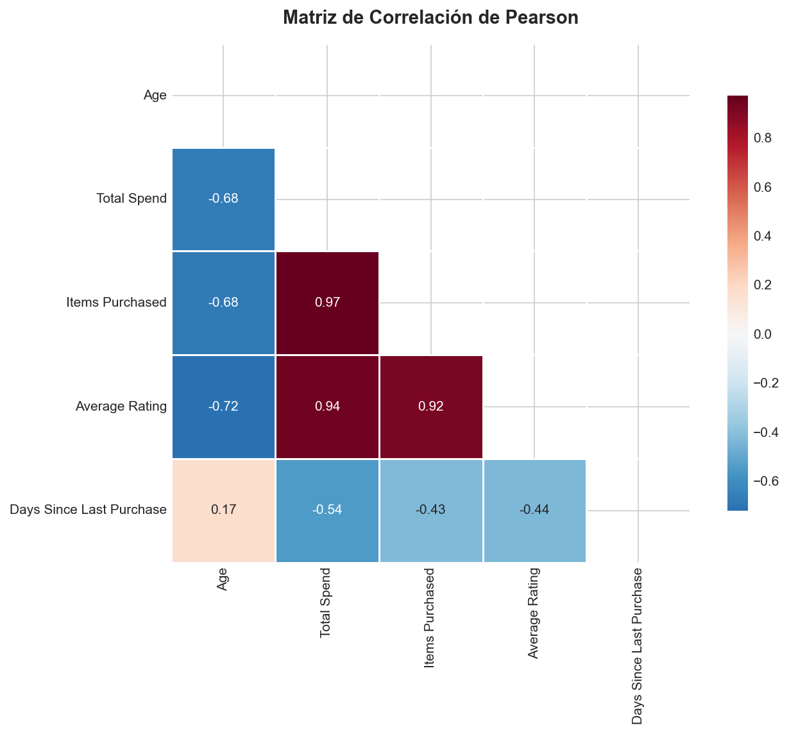

La matriz de correlación de Pearson revela las relaciones entre variables numéricas y orienta la selección de features.

#### 5.3.3 Selección final de features

Las 6 variables seleccionadas para el clustering fueron:

| Variable | Justificación                                                                     |
|:---|:----------------------------------------------------------------------------------|
| `Age` | Dimensión demográfica para verificar si la edad influye en los patrones de compra |
| `Total Spend` | Proxy de valor monetario del cliente (métrica de negocio crítica)                 |
| `Items Purchased` | Diversificación del carrito y frecuencia de exploración                           |
| `Average Rating` | Nivel de satisfacción percibida con la plataforma                                 |
| `Days Since Last Purchase` | ¿Cuántos días lleva el cliente sin adquirir un producto?                          |
| `Membership_encoded` | Nivel de compromiso formal con la plataforma (Bronze/Silver/Gold)                 |

**Variables descartadas:**
- `Customer ID`: Identificador sin valor predictivo.
- `Gender`: Se excluyó del clustering para evitar que el algoritmo se sesgue por género, pero se analizó a posteriori como variable de validación (reveló patrones interesantes en la composición de cada cluster).
- `City`: Variable categórica con alta cardinalidad (10 ciudades) sin patrón geográfico claro para clustering.
- `Discount Applied` y `Satisfaction Level`: Se excluyeron para evitar data leakage, ya que son consecuencias del comportamiento, no variables tipo driver que podrían sesgar la clasificación.

#### 5.3.4 Estandarización con StandardScaler

Se aplicó `StandardScaler` (media = 0, desviación estándar = 1) a las 6 variables seleccionadas. Esta normalización es **crítica** por las siguientes razones:
- Dado que K-Means y DBSCAN calculan distancias euclidianas, y variables con escalas distintas, las de mayor valor dominarían el cálculo de distancia.
- Sin escalar, `Total Spend` tendría un peso desproporcionado frente a `Age` o `Average Rating`, distorsionando la formación de clusters.

#### 5.3.5 Distribuciones y Pairplot exploratorio
Se generaron histogramas con KDE para las variables numéricas, verificando distribuciones y detectando posibles outliers antes de aplicar algoritmos.

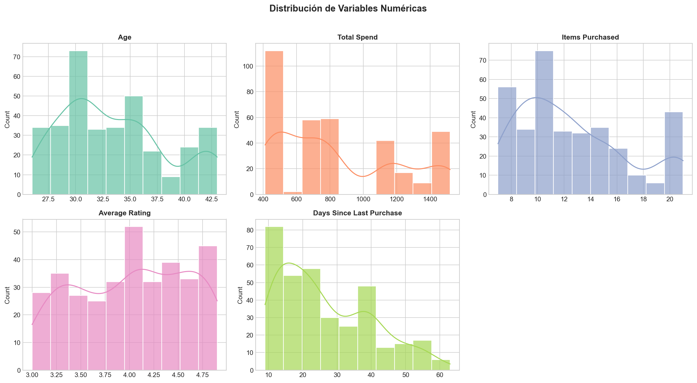

El pairplot permite visualizar relaciones bivariadas entre las 6 features seleccionadas, identificando agrupaciones naturales previas al clustering.

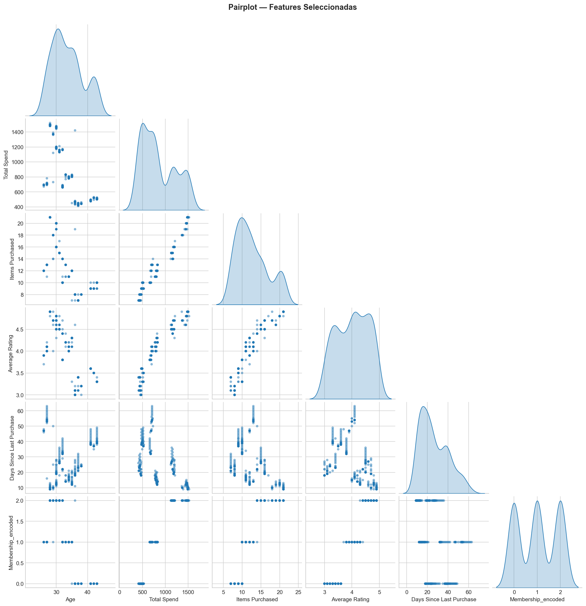

---

### 5.4 Clustering con K-Means

#### 5.4.1 Fundamento teórico

K-Means es un algoritmo no supervisado que particiona los datos en **K grupos** minimizando la **inercia** (suma de distancias cuadradas de cada punto a su centroide más cercano). El algoritmo itera entre: (1) asignar cada punto al centroide más cercano, y (2) recalcular los centroides como la media de los puntos asignados.

#### 5.4.2 Determinación del K óptimo — Método del Codo + Silhouette

Se ejecutó K-Means para `k = 1` hasta `k = 9`, registrando la inercia y el Silhouette Score de cada modelo.

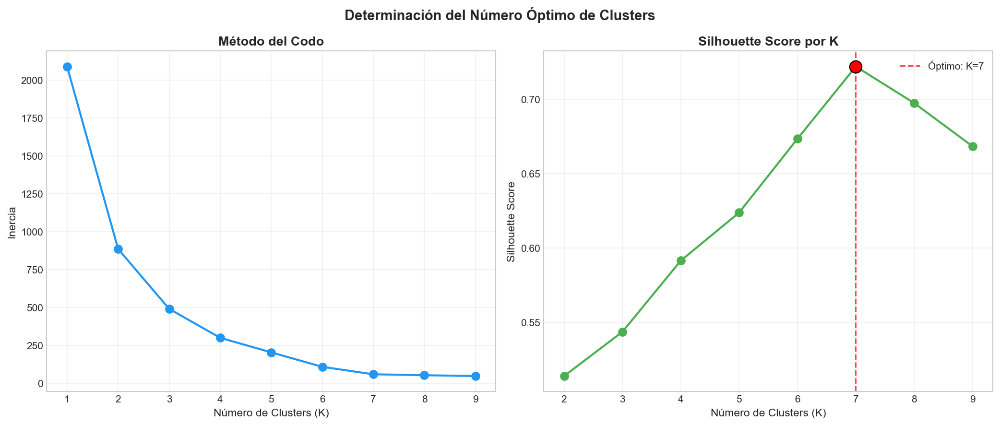

**Análisis del resultado:**
- **Silhouette Score máximo:** K=7 (0.722), indicando clusters muy bien separados para ese valor.
- **Método del Codo:** La curva de inercia muestra inflexión pronunciada en K=3, con reducción gradual después.

La decisión final con el equipo fue utilizar **K=3** clusters, dado que si bien K=7 maximiza la métrica de silhouette, K=3 corresponde al punto de inflexión del codo y se alinea con la estructura natural de membresías del negocio (Bronze, Silver, Gold). }
Fragmentar más allá generaría micro-segmentos difíciles de operacionalizar en campañas reales. El Silhouette Score de 0.544 para K=3 es bueno y confirma una separación clara.

#### 5.4.3 Ajuste del modelo y visualización

Se entrenó el modelo final con `KMeans(n_clusters=3, random_state=42)` sobre los datos escalados.

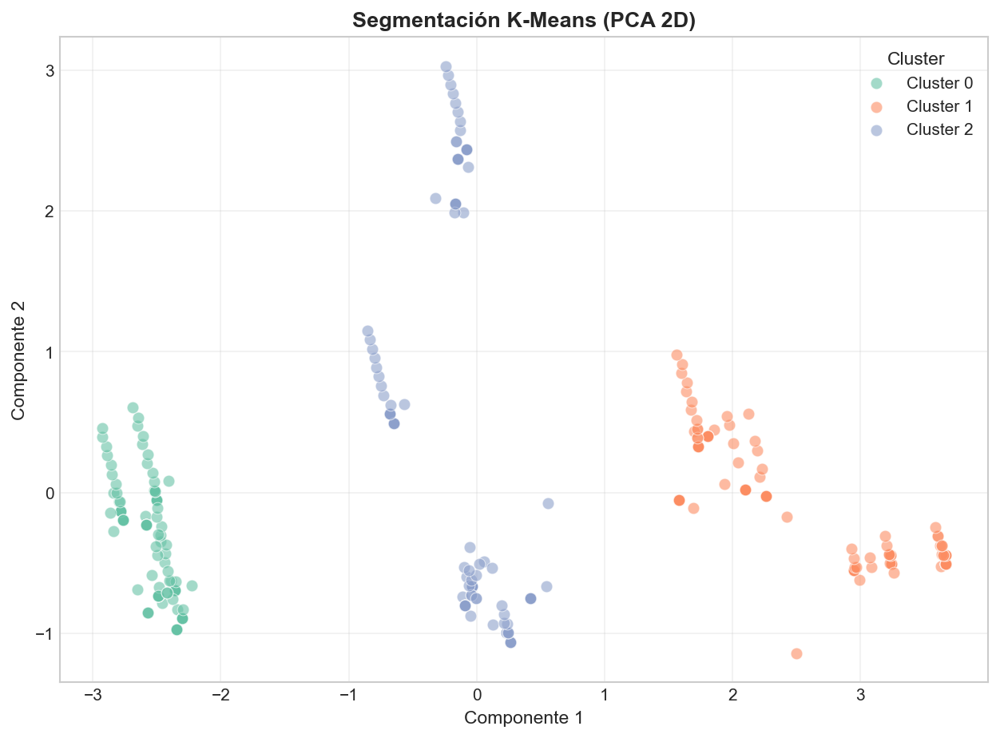

Como resultado, se observan 3 grupos claramente diferenciados en el espacio PCA 2D, con separación casi total entre clusters.

#### 5.4.4 Centroides en escala original

Para interpretar los clusters en métricas de negocio, se aplicó `scaler.inverse_transform()` a los centroides:

| Cluster | Age | Total Spend ($) | Items | Avg Rating | Days Since Purchase | Membership |
|:--------|:----|:----------------|:------|:-----------|:--------------------|:-----------|
| 0       | ~39 | **~$474**       | ~9    | **3.33**   | **~32 días**        | Bronze     |
| 1       | ~30 | **~$1,311**     | **~18** | **4.68** | ~18 días            | Gold       |
| 2       | ~32 | ~$748           | ~12   | 4.05       | ~30 días            | Silver     |

Un punto a considerar aquí, es que K-Means identificó que el nivel de membresía es el factor dominante de segmentación. 
Los 3 clusters se alinean uno a uno con Bronze, Silver y Gold, con separación perfecta entre ellos.

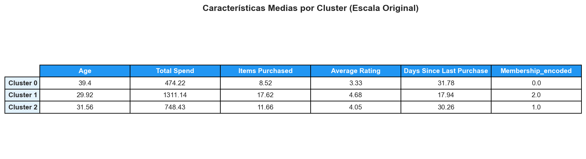

---

### 5.5 Clustering con DBSCAN

#### 5.5.1 Fundamento teórico

DBSCAN (Density-Based Spatial Clustering of Applications with Noise) agrupa puntos basándose en **densidad**, sin necesidad de definir el número de clusters a priori. Sus parámetros clave son:
- **eps (1.25):** Radio máximo para considerar que dos puntos son "vecinos" (estimado automáticamente mediante k-distance graph).
- **min_samples (5):** Número mínimo de puntos dentro del radio `eps` para formar un cluster denso.

A diferencia de K-Means, DBSCAN puede detectar clusters de forma arbitraria e identifica automáticamente **outliers** (etiquetados como `-1`).

#### 5.5.2 Resultados y visualización

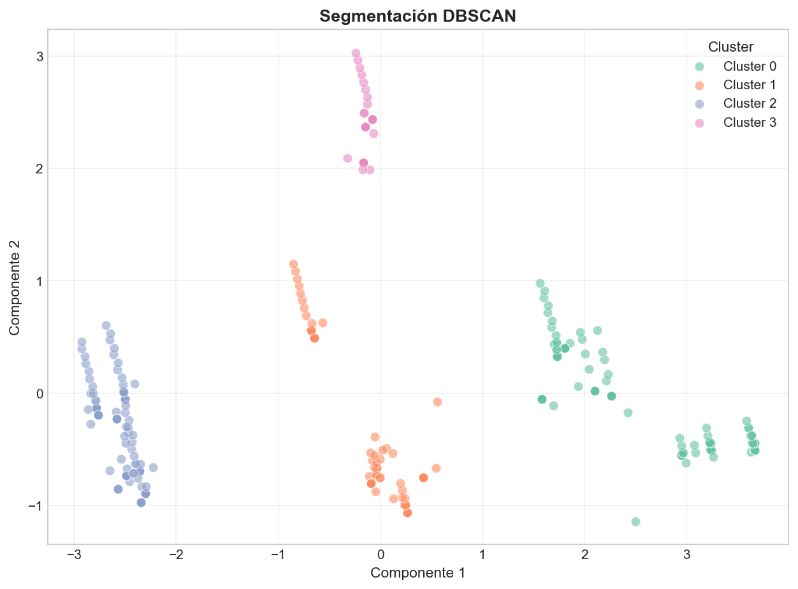

DBSCAN identificó **4 clusters** sin puntos de ruido, con un Silhouette Score de **0.595** (superior al 0.544 de K-Means con K=3).

| Cluster DBSCAN | n    | %     | Correspondencia con K-Means |
|:---------------|:-----|:------|:----------------------------|
| 0              | 117  | 33.6% | ≈ K-Means Cluster 1 (Gold) |
| 1              | 83   | 23.9% | ⊂ K-Means Cluster 2 (Silver "core") |
| 2              | 114  | 32.8% | ≈ K-Means Cluster 0 (Bronze) |
| **3**          | **34** | **9.8%** | **Sin equivalente** — Silver en riesgo de churn |

Lo importante aquí es que DBSCAN detectó que el segmento Silver no es homogéneo. 
Dentro del grupo Silver, existe un sub-grupo de 34 clientes jóvenes (~27 años) con **53 días de inactividad** y **100% insatisfacción** que se diferencia del Silver "core" por su lejanía temporal. 
K-Means los diluye dentro del Cluster 2 (Silver general), pero DBSCAN los aísla como una isla de densidad separada gracias a su sensibilidad a la estructura espacial.

En conclusión, ambos algoritmos aportan valor complementario. K-Means proporciona los 3 segmentos macro para estrategia comercial. DBSCAN añade inteligencia granular al revelar el micro-segmento de "Desertores Silenciosos" que requiere intervención inmediata.

---

### 5.6 Comparación K-Means vs DBSCAN

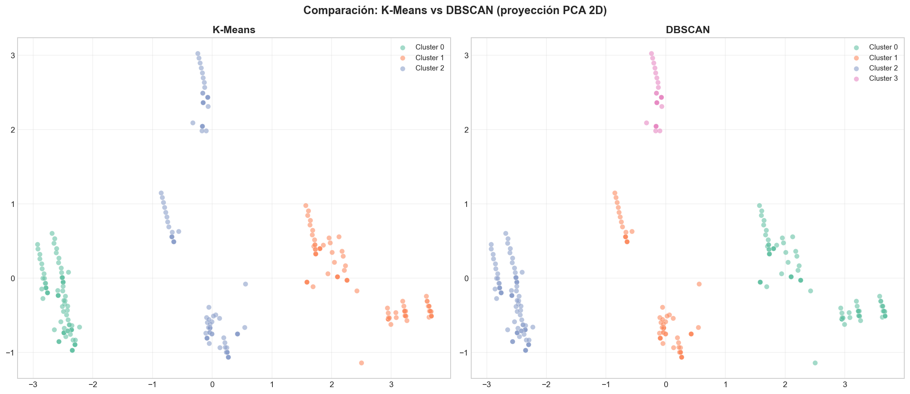

El gráfico comparativo lado a lado, proyectado sobre PCA 2D evidencia las diferencias clave:
- **K-Means (izquierda):** Se visualizan 3 particiones limpias y simétricas. Útil para estrategia masiva desde marketing.
- **DBSCAN (derecha):** Se visualizan 4 clusters asimétricos. Los 3 principales coinciden con K-Means, pero el Cluster 3 rosado emerge como grupo separado, a los que se les llamó los "Desertores Silenciosos" que se despegan verticalmente por su alta recencia (Days Since Last Purchase).

---

### 5.7 Reducción de dimensionalidad - visualización

#### 5.7.1 PCA (Principal Component Analysis)

PCA es una técnica **lineal** que transforma las variables originales en nuevas variables artificiales (Componentes Principales) que son combinaciones lineales de las originales. Cada componente maximiza la varianza explicada de los datos.

Se redujo de 6 dimensiones a 2 componentes principales para visualizar los clusters en un plano 2D:

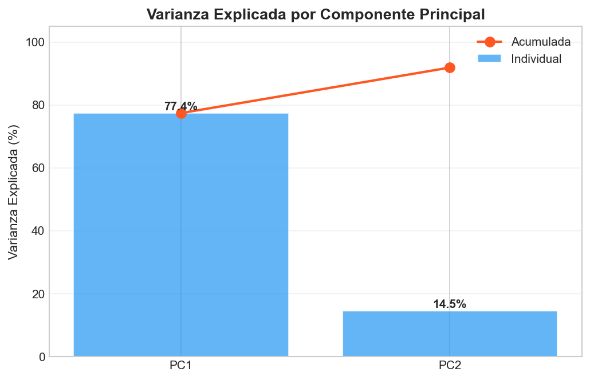

##### Interpretación de los pesos (Loadings) del PCA

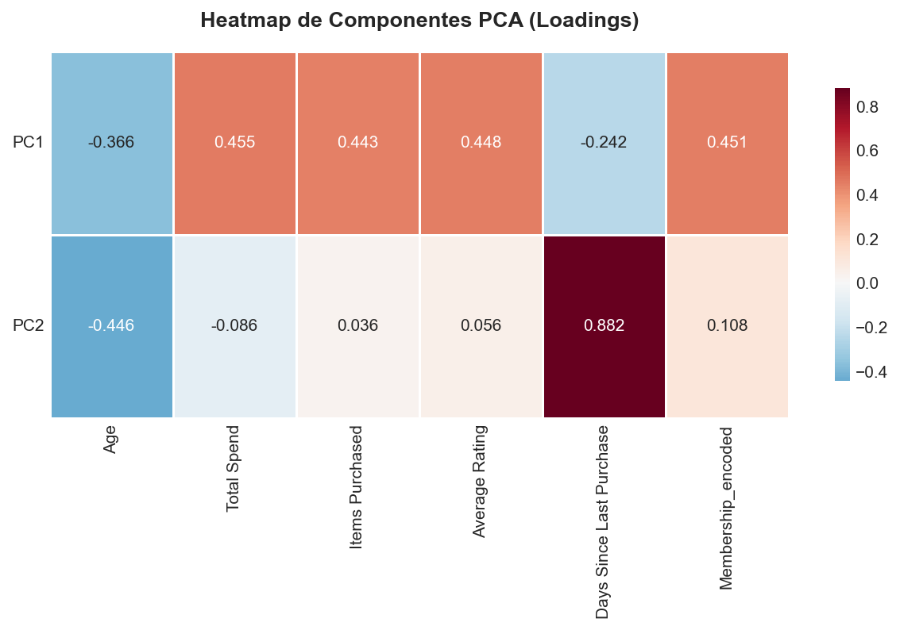

- **Componente 1 (Eje X — Engagement Comercial):** Las variables `Total Spend` (0.455), `Membership` (0.451), `Items Purchased` (0.443) y `Average Rating` (0.448) tienen pesos elevados y casi idénticos. `Age` contribuye con peso negativo (-0.366). El Componente 1 mide la **intensidad de relación comercial** del cliente: a mayor puntaje, mayor gasto, frecuencia y satisfacción.
- **Componente 2 (Eje Y — Recencia Temporal):** El peso dominante es `Days Since Last Purchase` (0.882), con contribución mínima del resto. El Componente 2 captura exclusivamente **cuánto tiempo hace que el cliente no compra**. Esto explica por qué los "Desertores Silenciosos" de DBSCAN aparecen separados verticalmente — su alta recencia los empuja hacia arriba en el eje Y.

Como punto importante aquí es que los datos de e-commerce se resumen en dos dimensiones interpretables: "¿Cuánto engagement tiene el cliente?" (PC1) y "¿Cuándo fue su última compra?" (PC2). Esta simplificación permite tomar decisiones de negocio sin necesidad de analizar las 6 variables simultáneamente.

#### 5.7.2 t-SNE (t-Distributed Stochastic Neighbor Embedding)

t-SNE es una técnica de reducción de dimensionalidad **no lineal** diseñada para preservar la **estructura local** de los datos: puntos cercanos en el espacio original permanecen cercanos en la proyección 2D.

Parámetros utilizados:
- **perplexity = 30:** Balance entre estructura local y global.
- **learning_rate = 200:** Velocidad de convergencia del gradiente.
- **random_state = 42:** Reproducibilidad.

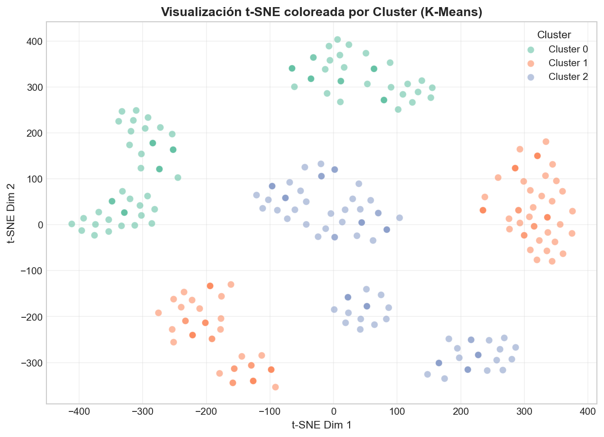

De este resultado se puede interpretar que la visualización t-SNE muestra "islas" topológicas claramente separadas que coinciden con los clusters de K-Means. Los clusters Gold y Bronze aparecen como regiones completamente desconectadas, mientras que Silver se fragmenta en zonas que anticipan la separación que DBSCAN detecta formalmente. Los grupos identificados representan **comunidades naturales** en los datos, no particiones artificiales del algoritmo.

---

## 6. Respuestas a las preguntas de reflexión

### 1. ¿Qué tipo de perfiles de usuarios/consumidores se pueden identificar?

Se han consolidado **3+1 Arquetipos de Comportamiento Comercial**:

1.  **Las Fantasmas Bronze (K-Means Cluster 0):**
    * *Perfil:* Clientas mayores (~39 años, 100% mujeres, 100% Bronze).
    * *Rasgo:* Gasto mínimo ($474), rating más bajo (3.33), 32 días inactivas.
    * *Estrategia:* Retención urgente con campañas específicas para público femenino.

2.  **Los Champions Gold (K-Means Cluster 1):**
    * *Perfil:* Clientes jóvenes (~30 años, balance de género, 100% Gold).
    * *Rasgo:* Gasto máximo ($1,311), compras cada 18 días, 100% satisfechos.
    * *Estrategia:* Programas de referidos, exclusividad y retención VIP.

3.  **Los Silver Invisibles (K-Means Cluster 2):**
    * *Perfil:* Hombres jóvenes (~32 años, 99% masculino, 100% Silver).
    * *Rasgo:* Engagement moderado, satisfacción mixta, potencial de upgrade.
    * *Estrategia:* Nurturing para conversión a Gold.

4.  **Los Desertores Silenciosos (DBSCAN Cluster 3):**
    * *Perfil:* Jóvenes (~27 años, Silver, 100% insatisfechos).
    * *Rasgo:* 53 días sin comprar — el doble del promedio. Sub-grupo en abandono activo.
    * *Estrategia:* Intervención directa e inmediata.

---

### 2. ¿Qué diferencias clave surgieron entre los modelos?

* **K-Means (Enfoque de Segmentación Macro):**
    * Funcionó como un **segmentador de mercado** que particionó la base en 3 grupos limpios y simétricos (~33% cada uno).
    * Los clusters se alinean 1:1 con los niveles de membresía, validando que la estructura de negocio refleja patrones reales.
    * Silhouette Score de 0.544 — excelente separación.

* **DBSCAN (Enfoque de Descubrimiento Granular):**
    * Funcionó como un **descubridor de estructura** que encontró 4 clusters asimétricos sin necesidad de especificar K.
    * Reprodujo los 3 segmentos principales de K-Means, pero además **aisló un micro-segmento de alto riesgo** (34 Silver en abandono) que K-Means no puede detectar por su naturaleza de partición equitativa.
    * Silhouette Score de 0.595 — superior a K-Means, sugiriendo que la estructura real de los datos tiene 4 grupos, no 3.

**Conclusión:** Ambos algoritmos son complementarios. K-Means define la estrategia macro (3 tiers de membresía). DBSCAN añade la capa de inteligencia granular para detección temprana de riesgos. Un pipeline de producción debería ejecutar ambos: K-Means para campañas y DBSCAN como sistema de alerta.

---

### 3. ¿Qué aporta PCA/t-SNE a la interpretación de los clusters?

* **PCA (Análisis de Componentes Principales):**
    * Reveló que el 91.9% de la varianza se concentra en 2 dimensiones interpretables: **Engagement Comercial** (PC1) y **Recencia Temporal** (PC2).
    * Los loadings demostraron que `Total Spend`, `Membership`, `Items Purchased` y `Average Rating` co-varían como un bloque (el "factor engagement"), mientras que `Days Since Last Purchase` opera como dimensión independiente.
    * La separación vertical de los "Desertores Silenciosos" en PC2 confirma que su característica diferenciadora es la inactividad temporal, no el nivel de gasto.

* **t-SNE (t-Distributed Stochastic Neighbor Embedding):**
    * Confirmó visualmente que los clusters son **comunidades naturales** en los datos, no artefactos algorítmicos.
    * Las "islas" de t-SNE son consistentes con las particiones de K-Means, lo que refuerza la confianza en los resultados.

---

### 4. ¿Qué limitaciones encontraron y cómo las abordarían?

1.  **Tamaño del dataset (348 registros válidos):** Es relativamente pequeño. Con más datos, los patrones serían más robustos y estadísticamente significativos. Se podría complementar con datos de logs de navegación o transacciones individuales.

2.  **Rango de edad estrecho (26-43 años):** La base de clientes es relativamente homogénea en edad, lo que limita el poder discriminante de esta variable. Con una base más diversa, la edad podría revelar patrones adicionales.

3.  **Sesgo de género en clusters:** K-Means Cluster 0 es 100% femenino y Cluster 2 es 99% masculino. Esto podría indicar un sesgo en la generación del dataset o un patrón real de segmentación por género que merece investigación adicional.

4.  **Variables categóricas como features:** El encoding ordinal de Membership Type asume equidistancia (Bronze→Silver = Silver→Gold) que puede no reflejar la realidad del negocio. Se podría explorar One-Hot Encoding o embedding categórico.

5.  **Ausencia de datos temporales:** El dataset es una foto estática. Un análisis longitudinal (evolución del comportamiento en el tiempo) permitiría detectar trayectorias de upgrade/downgrade y predecir churn con mayor anticipación.


---
## Conclusiones:
1. La membresía no es solo una etiqueta, es un reflejo fiel del comportamiento real. Los 3 clusters de K-Means se alinearon uno a uno con Bronze, Silver y Gold sin que el algoritmo "supiera" de la existencia de estas categorías. Esto valida que el sistema de membresías actual de la plataforma captura patrones de compra genuinos — no son categorías arbitrarias. El Silhouette Score de 0.544 confirma una separación estadísticamente sólida entre los tres perfiles, lo que significa que las campañas diferenciadas por tier tienen fundamento empírico, no solo intuitivo.
2. Existe un segmento Silver "en coma" que las métricas agregadas ocultan. DBSCAN reveló que el 29% de los clientes Silver están en estado de abandono activo: 53 días sin comprar, 100% insatisfechos. A nivel agregado, el tier Silver parece "estable" con gasto intermedio y rating aceptable. Pero esa media esconde una fractura interna entre Silver activos y Silver desertores. Sin esta granularidad, el equipo de marketing estaría invirtiendo presupuesto de retención de forma homogénea en un grupo que en realidad necesita dos tratamientos completamente distintos.
3. La edad no predice el valor del cliente, pero el género marca una polarización inesperada. El rango etario del dataset es estrecho y los centroides de los 3 clusters tienen edades similares, por lo que la edad no es un eje de segmentación útil aquí. Sin embargo, el análisis post-clustering reveló que Bronze es 100% femenino y Silver es 99% masculino, mientras que Gold tiene equilibrio perfecto 50/50. Esto sugiere que las barreras de upgrade de Bronze a Silver (y de Silver a Gold) podrían estar operando de forma diferenciada por género, lo cual tiene implicaciones directas en el diseño de campañas.

## Recomendaciones
1. Implementar un sistema de alertas automatizadas basado en recencia por tier. El hallazgo de los "Desertores Silenciosos" demuestra que el indicador más potente de riesgo de churn no es el gasto ni el rating, sino los días sin compra. Se recomienda configurar triggers automáticos: si un cliente Silver supera los 35 días sin actividad, debe activarse una secuencia de reactivación escalonada. Para Bronze, el umbral debería ser de 25 días dado que su recencia promedio ya es de 32 días. Este sistema es implementable con las herramientas de marketing automation actuales y no requiere inversión adicional en infraestructura.
2. Diseñar dos tracks de comunicación diferenciados por género para los tiers Bronze y Silver. La polarización de género en estos clusters no puede ignorarse. Para las clientas Bronze, se recomienda una campaña de investigación cualitativa primero (encuestas, focus groups) para entender qué está fallando específicamente en su experiencia, seguida de una campaña de reactivación con propuesta de valor ajustada a los hallazgos. Para los clientes Silver masculinos, el enfoque debe ser de upgrade: mostrar el diferencial concreto entre Silver y Gold (el gasto Gold es 1.75x Silver, pero la satisfacción pasa de 7% a 100%) mediante comparativas tangibles tipo "por $X más al mes, esto es lo que obtienes". El tier Gold, con su equilibrio 50/50, debe mantener comunicación neutra y enfocada en exclusividad.
3. Ejecutar DBSCAN trimestralmente como complemento a las métricas estándar de CRM. K-Means es excelente para definir los segmentos macro sobre los que se construye la estrategia anual, pero DBSCAN aporta una capacidad que los dashboards tradicionales no tienen: detectar sub-grupos emergentes que aún no son visibles en los promedios. Se recomienda integrar una ejecución trimestral de DBSCAN sobre los datos actualizados del CRM para identificar nuevos micro-segmentos de riesgo o de oportunidad antes de que se conviertan en tendencias irreversibles. El Cluster 3 de este análisis es un ejemplo perfecto: si se hubiera detectado hace 2 meses, esos 34 clientes posiblemente aún serían recuperables.

---
## Origen: https://github.com/jefferson-velasquez-uees/ml-unsupervised-models
---
